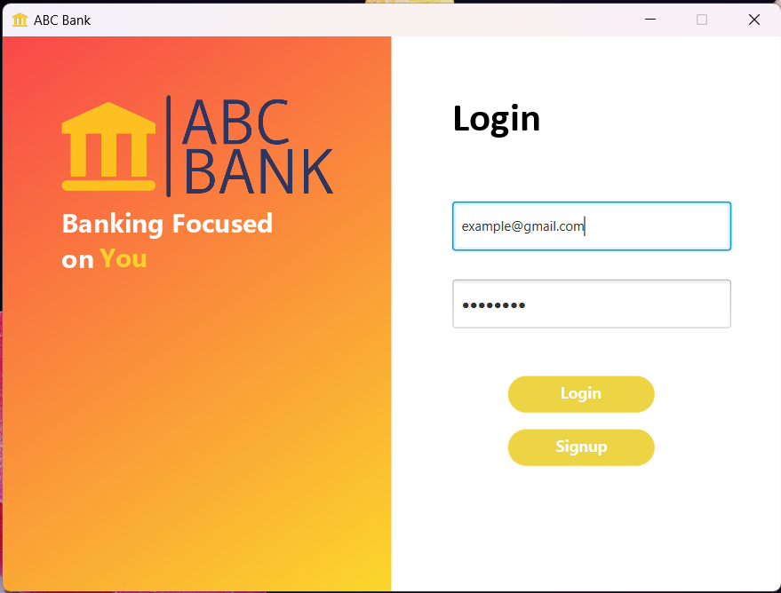
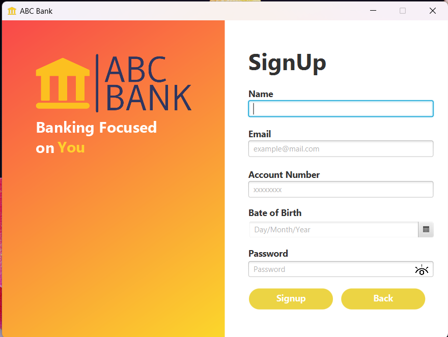
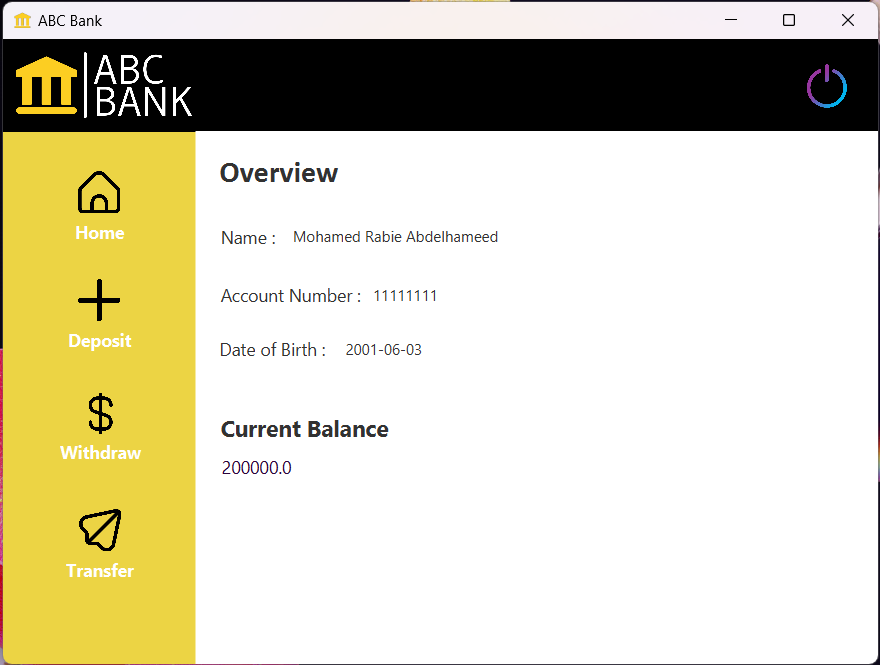
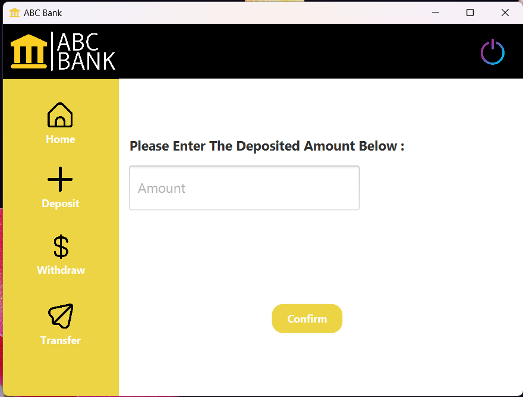
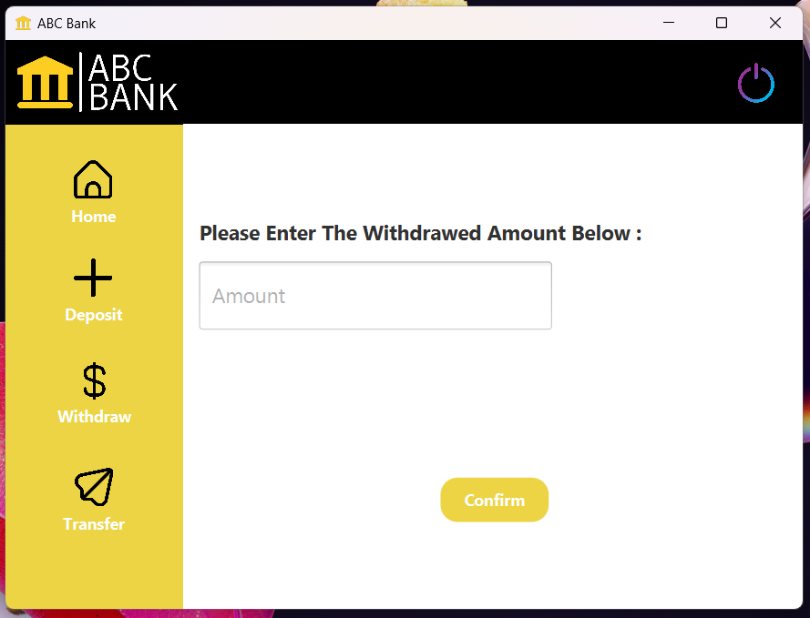
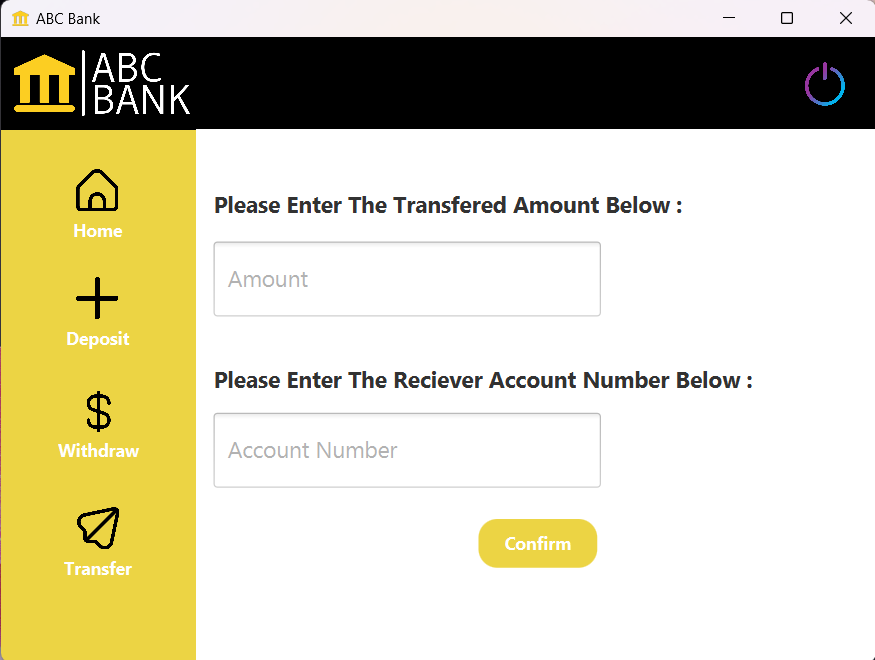

# Online-Banking-Application
A simple online banking application using javafx and MySQL
## The Application consists of:
- Login page
- Signup page
- Home page (Gives an overview of user account)
- Deposit page (Allows the user to enter the amount to be deposited into his account)
- Withdraw page (Allows the user to enter the amount to be withdrawed from his account)
- Transfer page (Allows the user to enter the amount to be transferred and the reciever's account number)

